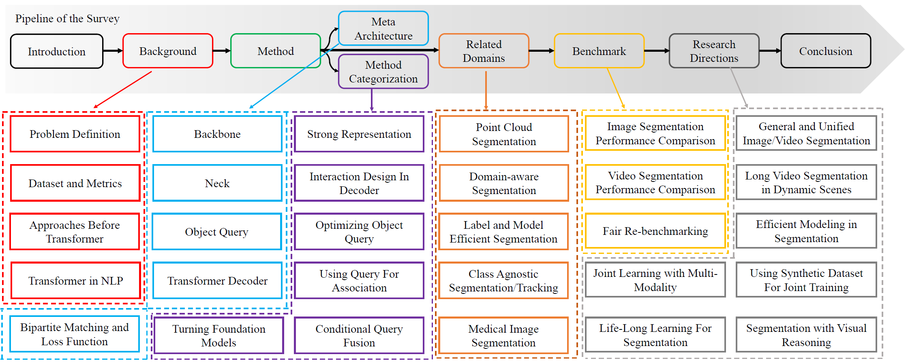

 <!-- # 
`awesome gan-inversion`
 -->

 

  <h1 align="center">Transformer-Based Visual Segmentation: A Survey</h1>
  

    Arxiv, 2023
     
    <a href="https://lxtgh.github.io/"><strong>Xiangtai Li</strong></a>
    ·
    <a href="https://henghuiding.github.io/"><strong>Henghui Ding</strong></a>
    ·
    <a href="https://zhangwenwei.cn/"><strong>Wenwei Zhang</strong></a>
    ·
    <a href="https://yuanhaobo.me/"><strong>Haobo Yuan</strong></a>
    ·
    <a href="https://sites.google.com/view/guangliangcheng"><strong>Guangliang Cheng</strong></a>
     
    <a href="https://oceanpang.github.io/"><strong>Jiangmiao Pang</strong></a>
    .
    <a href="https://chenkai.site/"><strong>Kai Chen</strong></a>
    .
    <a href="https://liuziwei7.github.io/"><strong>Ziwei Liu</strong></a>
    .
    <a href="https://www.mmlab-ntu.com/person/ccloy/"><strong>Chen Change Loy</strong></a>
  

  

    
    
  

 

This repo is used for recording, tracking and benchmarking several recent transformer-based visual segmentation methods, 
as a supplement for our [survey]().  
If you find any work missing or have any suggestions (papers, implementations and other resources), feel free to [pull requests](https://github.com). 
We will add the missing papers in this repo ASAP.

### Highlight!!

Previous Transformer surveys divide the methods by the different tasks and settings. 
Different from these, we re-visit and group the existing transformer-based methods from the **technical perspective.**

## Introduction

In this survey, we present the first detailed survey on Transformer-Based Segmentation.

## Summary of Contents

- [Methods: A Survey](#methods-a-survey)
  - [Meta-Architecture](#meta-architecture)
  - [Strong Representation](#Strong-Representation)
    - [Better ViTs Design](##Better-ViTs-Design)
    - [Hybrid CNNs/Transformers/MLPs](##Hybrid CNNs/Transformers/MLPs)
    - [Self-Supervised Learning](##Self-Supervised Learning)
  - [Interaction Design in Decoder](#Interaction Design in Decoder)
    - [Improved Cross Attention Design](##Improved Cross Attention Design)
    - [Spatial-Temporal Cross Attention Design](##Spatial-Temporal Cross Attention Design)
  - [Optimizing Object Query](#Optimizing Object Query)
    - [Adding Position Information into Query](##Adding Position Information into Query)
    - [Adding Extra Supervision into Query](##Adding Extra Supervision into Query)
  - [Using Query For Association](#Using Query For Association)
    - [Query as Instance Association](##Query as Instance Association)
    - [Query as Linking Multi-Tasks](##Query as Linking Multi-Tasks)
  - [Conditional Query Generation](#Conditional Query Generation)
    - [Conditional Query Fusion on Language Features](##Conditional Query Fusion on Language Features)
    - [Conditional Query Fusion on Cross Image Features](##Conditional Query Fusion on Cross Image Features)
  - [Turning Foundation Models](#Turning Foundation Models)
    - [Vision Adapter](##Vision Adapter)
    - [Open Vocabulary Learning](##Open Vocabulary Learning)
  
- [Related Domains and Beyond](#Related Domain and Beyond)
  - [Point Cloud Segmentation](#Point Cloud Segmentation)
  - [Domain-aware Segmentation](#Domain-aware Segmentation)
  - [Label and Model Efficient Segmentation](#Label and Model Efficient Segmentation)
  - [Class Agnostic Segmentation and Tracking](#Class Agnostic Segmentation and Tracking)
  - [Medical Image Segmentation](#Medical Image Segmentation)
    
## Methods: A Survey

### Meta-Architecture

| Year |  Venue  |      Acronym       | Paper Title                                                                                                    | Project                                                      |
|:----:|:-------:|:------------------:|----------------------------------------------------------------------------------------------------------------|--------------------------------------------------------------|
| 2020 |  ECCV   |        DETR        | [End-to-End Object Detection with Transformers](https://arxiv.org/abs/2005.12872)                              | [Code](https://github.com/facebookresearch/detr)             |
| 2021 |  ICLR   |  Deformable DETR   | [Deformable DETR: Deformable Transformers for End-to-End Object Detection](https://arxiv.org/abs/2010.04159)   | [Code](https://github.com/fundamentalvision/Deformable-DETR) |
| 2021 |  CVPR   |    Sparse R-CNN    | [Sparse R-CNN: End-to-End Object Detection with Learnable Proposals](https://arxiv.org/abs/2011.12450)         | [Code](https://github.com/PeizeSun/SparseR-CNN)              |
| 2022 |  CVPR   |      AdaMixer      | [AdaMixer: A Fast-Converging Query-Based Object Detector](https://arxiv.org/abs/2203.16507)                    | [Code](https://github.com/MCG-NJU/AdaMixer)                  |
| 2021 |  CVPR   |    MaX-DeepLab     | [MaX-DeepLab: End-to-End Panoptic Segmentation with Mask Transformers](https://arxiv.org/abs/2012.00759)       | [Code](https://github.com/google-research/deeplab2)          |
| 2021 | NeurIPS |       K-Net        | [K-Net: Towards Unified Image Segmentation](https://arxiv.org/abs/2106.14855)                                  | [Code](https://github.com/ZwwWayne/K-Net/)                   |
| 2022 |  CVPR   |    Mask2Former     | [Masked-attention Mask Transformer for Universal Image Segmentation](https://arxiv.org/abs/2112.01527)         | [Code](https://github.com/facebookresearch/Mask2Former)      |
| 2022 |  ECCV   |    kMaX-DeepLab    | [k-means Mask Transformer](https://arxiv.org/abs/2207.04044)                                                   | [Code](https://github.com/google-research/deeplab2)          |                                                                                         |
| 2021 |  CVPR   |       VisTR        | [VisTR: End-to-End Video Instance Segmentation with Transformers](https://arxiv.org/abs/2011.14503)            | [Code](https://github.com/Epiphqny/VisTR)                    |
| 2022 | NeurIPS |        VITA        | [VITA: Video Instance Segmentation via Object Token Association](https://arxiv.org/abs/2206.04403)             | [Code](https://github.com/sukjunhwang/VITA)                  |
| 2022 |  CVPR   | TubeFormer-DeepLab | [TubeFormer-DeepLab: Video Mask Transformer](https://arxiv.org/abs/2205.15361)                                 | N/A                                                          |
| 2022 |  CVPR   |    Video K-Net     | [Video K-Net: A Simple, Strong, and Unified Baseline for Video Segmentation](https://arxiv.org/abs/2204.04656) | [Code](https://github.com/lxtGH/Video-K-Net)                 |

### Strong Representation

#### Better ViTs Design

test

#### Hybrid CNNs/Transformers/MLPs

test

#### Self-Supervised Learning

test

## Related Domains and Beyond 

## Acknowledgement
If you find our survey and repository useful for your research project , please consider citing our paper:

<pre><code class="language-bib" style="font-size: 0.9rem;" id="citation">@article{lxt_seg_survey,
    author  = {Li, Xiangtai and Ding, Henghui and Zhang, Wenwei and Yuan, Haobo and Cheng, Guangliang and Jiangmiao, Pang and Chen, Kai and Liu, Ziwei and Loy, Chen Change},
    title   = {Transformer-Based Visual Segmentation: A Survey},
    journal = {arxiv},
    year={2023}
  }
</code></pre>

